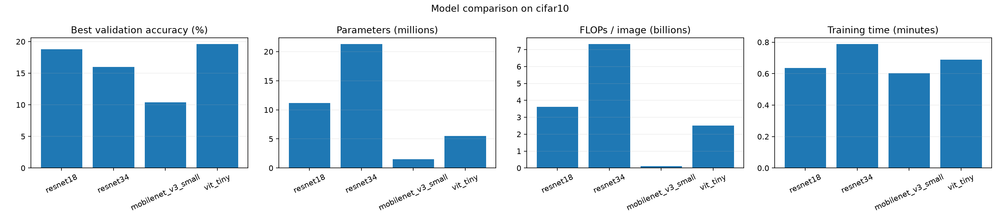
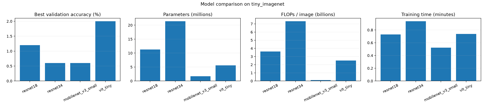

# 图像分类模型对比：ResNet、MobileNetV3、ViT

面向初学者的 PyTorch 图像分类实验项目。用统一的数据处理、训练循环和评估方式，对比 ResNet-18/34、MobileNetV3-Small、ViT-Tiny 在 CIFAR-10 和 Tiny ImageNet 上的准确率、参数量、计算量、训练时间与训练轮数。

> 默认配置用于入门和快速复现。不同硬件、随机种子、训练轮数会影响结果；比较时请以本次生成的 `results/` 文件为准。FLOPs 按每张输入图像估算，口径为 MACs×2。

## 正式实验（全量数据）

```bash
python -m venv .venv
source .venv/bin/activate  # Windows: .venv\\Scripts\\activate
pip install -r requirements.txt
python run_full.py
```

正式实验使用 64×64 统一输入，固定随机种子 42。CIFAR-10 从 50,000 张训练图中划出 5,000 张验证图，原 10,000 张测试图只在训练结束后评估一次；Tiny ImageNet 从 100,000 张训练图中划出 10,000 张验证图，原带标签的 10,000 张验证图作为最终测试集。训练最多 40 轮，至少 15 轮，验证准确率连续 8 轮不提高就提前停止，并在停滞时降低学习率。每轮自动保存历史和可恢复训练状态；重新运行命令会继续未完成的实验。

完整实验的结果、解读和复现方法见 [RESULTS_FULL.md](RESULTS_FULL.md)。逐轮日志和汇总表保存在 `results/full/`，最佳权重保存在 `checkpoints/full/`，并随 [正式训练权重 Release](https://github.com/3513542967-creator/image-classification-model-comparison/releases/tag/v0.2.0) 发布。`results/full/comparison.csv` 包含最终测试准确率、参数量、每张图的 FLOPs、训练时长、最佳轮次，以及达到最佳验证准确率 95% 所需的轮次与时间。每个数据集另有按轮次和按实际训练时间绘制的收敛曲线、参数/计算量关系图、训练轮数/耗时图。这里的“参数效率”与“计算效率”只是具体任务下的描述性指标，不等于模型的通用智能水平。

下载 Release 中的压缩包并在项目根目录解压后，可以直接加载最佳权重，例如：

```python
import torch
from models import build_model

model = build_model("resnet18", num_classes=10, image_size=64)
state = torch.load("checkpoints/full/cifar10/resnet18/best.pt",
                   map_location="cpu", weights_only=True)
model.load_state_dict(state)
model.eval()
```

下文的 `train.py` 和 `compare.py` 保留了首版 224×224 快速演示流程，已经发布的 1 轮抽样权重和图表对应那套流程。正式实验请使用上面的 `run_full.py`。

## 快速开始

```bash
python -m venv .venv
source .venv/bin/activate  # Windows: .venv\\Scripts\\activate
pip install -r requirements.txt
python train.py --dataset cifar10 --model resnet18 --epochs 5
```

模型选项：`resnet18`、`resnet34`、`mobilenet_v3_small`、`vit_tiny`。数据集选项：`cifar10`、`tiny_imagenet`。首次运行会将数据下载到 `data/`。Tiny ImageNet 约 100,000 张训练图像，首次下载和解压需要较多磁盘空间。

## 运行完整对比

```bash
python compare.py --epochs 5
```

每个模型依次在两个数据集上训练。可用 `--models resnet18 mobilenet_v3_small` 或 `--datasets cifar10` 缩小实验。默认种子为 42；可用 `--device auto|cpu|cuda|mps` 选择设备。若只想快速试运行，可加 `--max-train 2000 --max-valid 500`，脚本会从每个数据集固定种子抽取样本；省略这两个参数就使用全量数据。

## 项目结构

```text
models/       模型定义
data/         自动下载的数据集（不提交）
checkpoints/  最佳验证准确率权重（Git 忽略，随 Release 发布）
results/      训练日志、指标表和对比图（提交轻量结果文件）
train_full.py 正式实验的单次训练入口
run_full.py   正式实验的批量入口
analyze_full.py 生成正式实验对比图
train.py      快速演示的单次训练入口
compare.py    快速演示的批量入口
```

每次训练会保存 `checkpoints/<dataset>/<model>.pt`（模型权重及配置）、`results/logs/` 下的逐轮 CSV 和 JSON 指标，以及 `results/figures/` 下的损失/准确率曲线。完整对比结束后会输出汇总表和准确率、参数/FLOPs、训练耗时对比图。仓库附有一组快速演示结果：每个模型每个数据集用 2,000 张训练图、500 张验证图训练 1 轮。它用于展示流程和产物格式，不代表充分训练后的基准成绩；完整实验请使用默认全量数据和更多轮数。权重打包文件发布在 GitHub Releases。

## 说明

- CIFAR-10：60,000 张 32×32 彩色图像，10 类。Tiny ImageNet：约 100,000 张训练图像、10,000 张验证图像，200 类、64×64。快速演示模型缩放至 224×224；正式实验统一缩放至 64×64。
- 默认训练采用 AdamW 与交叉熵，按验证准确率保存最佳权重。所有模型从头训练，不加载预训练权重，以保持实验条件清晰。
- 参数量和计算量是模型结构的静态估算；训练耗时受设备影响。比较实验建议固定设备、随机种子和轮数。
- 权重文件较大，Git 默认忽略 `checkpoints/` 和数据，避免把大型二进制文件写入仓库历史。训练日志与图表保存在 `results/`。发布权重时，将 `checkpoints/` 压缩后附加到 GitHub Release。

## 快速演示图

CIFAR-10：



Tiny ImageNet：


